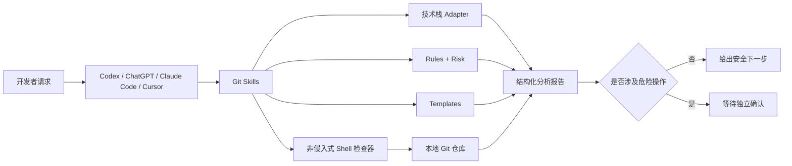

# developer-agent-skills

> 面向真实工程仓库的安全 Git AI Skills：先取证、再分析、分阶段确认、最后执行。


[](https://github.com/ggThree/developer-agent-skills/actions/workflows/quality.yml)


`developer-agent-skills` 是一套可维护、可审计、可组合的 Git 工作流 Skills，服务于 Codex、ChatGPT、Claude Code 与 Cursor。它不是替你盲目执行 Git 的命令集合，而是把仓库证据、技术栈规则、风险等级、确认边界和回滚方案组织成可复用的 Agent 能力。

## 核心价值

- **安全默认值**：检查脚本不改变工作区内容、refs 或暂存内容；`push`、`merge`、`rebase`、`reset` 必须单独确认。
- **证据优先**：先读取 `status`、分支、差异、暂存区和版本信息，再给结论。
- **跨技术栈**：自动识别 Objective-C、Swift、Vue、React、uni-app、Spring Boot 与 Node.js。
- **结构化输出**：复用统一的审查、风险、发布、合并与回滚模板。
- **跨平台 Shell**：兼容 macOS 与 Linux，公共逻辑集中维护，并接受 `shellcheck` 检查。
- **渐进披露**：Skill 只保留关键流程，细节按需读取 `shared/` 中的规则与参考资料。

## 架构



详细设计见 [docs/architecture.md](docs/architecture.md)。

## 快速安装

推荐把仓库保留为一个整体，并固定到经过审查的版本 Tag，再把所需 Skill 链接到宿主的发现目录。这样 `SKILL.md`、脚本、规则和模板始终保持同一版本。

```bash
git clone --branch v0.1.0 --depth 1 https://github.com/ggThree/developer-agent-skills.git
cd developer-agent-skills
mkdir -p "${HOME}/.agents/skills"
ln -s "$(pwd)/skills/Git/review-diff" "${HOME}/.agents/skills/review-diff"
```

上述示例安装稳定版 `v0.1.0`，并为 Codex/Cursor 链接 `review-diff`。需要参与开发时再单独 clone `main`，不要让正式环境静默跟随可变分支。Claude Code 使用 `~/.claude/skills/`；ChatGPT 桌面端通过 Skills 界面添加。完整平台说明、项目级安装与更新策略见 [安装文档](docs/installation.md)。

## 快速使用

在支持显式 Skill 调用的宿主中输入：

```text
$review-diff 审查当前未提交差异，重点检查支付回调和线程安全。
```

也可以直接用自然语言触发：

```text
请检查当前分支是否可以发布，列出阻断项、证据和回滚建议，不执行任何 Git 写操作。
```

直接运行确定性检查器：

```bash
./scripts/git_summary.sh
./scripts/release_check.sh
./scripts/merge_check.sh origin/main
./scripts/rollback_check.sh revert HEAD~1
```

参数、退出码和完整会话示例见 [使用文档](docs/usage.md) 与 [examples/](examples/README.md)。

## Skills

| Skill | 解决的问题 | 默认行为 |
| --- | --- | --- |
| [`safe-git-workflow`](skills/Git/safe-git-workflow/README.md) | 从工作区检查到提交、推送的分阶段安全流程 | 写操作逐步确认 |
| [`review-diff`](skills/Git/review-diff/README.md) | 按技术栈审查差异、影响、风险和测试 | 只读分析 |
| [`commit-message`](skills/Git/commit-message/README.md) | 生成中英文 Conventional Commit / Gitmoji | 不自动提交 |
| [`release-check`](skills/Git/release-check/README.md) | 检查工作区、调试代码、版本、Tag 和分支 | 输出发布结论 |
| [`merge-helper`](skills/Git/merge-helper/README.md) | 比较 merge、rebase、squash 并预判冲突 | 不执行合并 |
| [`rollback-helper`](skills/Git/rollback-helper/README.md) | 在 restore、revert、reset 中选择低风险方案 | 禁止默认 hard reset |

## 仓库目录

```text
developer-agent-skills/
├── VERSION             # 当前仓库的机器可读版本
├── skills/Git/          # 六个可安装 Skill
├── scripts/             # 可直接运行的 Git 检查器
├── shared/
│   ├── adapters/        # 技术栈识别与审查边界
│   ├── references/      # Git 与版本策略参考
│   ├── risk/            # Critical / High / Medium / Low 风险模型
│   ├── rules/           # Git、审查、发布和分栈规则
│   ├── scripts/         # Shell 公共函数
│   └── templates/       # 结构化报告与提交模板
├── examples/            # 完整输入、输出与决策样例
├── tests/               # 临时仓库驱动的安全集成测试
├── docs/                # 安装、使用、架构和维护文档
└── .github/             # CI、Issue 与 PR 协作规范
```

## 安全模型

本项目把“分析权”和“执行权”分开：脚本采集与汇总证据，Skill 形成建议，用户对危险操作逐次授权。仓库统一禁止 `git push --force`、`git reset --hard` 与 `rm -rf`。即使 Agent 建议正确，也应由分支保护、最小权限凭据、CI 和备份构成第二道防线。

风险判断细节见 [最佳实践](docs/best-practice.md) 和 [风险模型](shared/risk/critical.md)。

## 验证

```bash
find scripts shared/scripts tests -type f -name '*.sh' -exec sh -n {} +
find scripts shared/scripts tests -type f -name '*.sh' -exec bash -n {} +
shellcheck scripts/*.sh shared/scripts/*.sh tests/*.sh
./tests/integration.sh
```

CI 在 Ubuntu 24.04 上固定使用 ShellCheck 0.11.0，并在 macOS 15 上分别以 `/bin/sh` 和系统 Bash 3.2 运行集成测试。40 项集成测试只操作临时 Git 仓库，同时覆盖正常提交、完整变更清单、首次发布完整树、已同步发布、Node Workspace、成对删除与无冲突合并等成功路径，以及秘密脱敏、特殊路径、版本降级、伪造比较基线、隐藏文件状态、锁文件丢失/改名、shallow clone、submodule gitlink、回滚禁令、符号链接与损坏 index 等 fail-closed 路径。

## Roadmap

项目按“Git 安全基线 → 托管平台协作 → MCP 能力”的顺序演进，现阶段的可交付里程碑与兼容原则见 [docs/roadmap.md](docs/roadmap.md)。路线图不是功能承诺；每个里程碑需满足真实用例、回滚方案和自动化验证后才进入版本。

## FAQ

安装路径、Skill 未触发、脏工作区、fetch 与 push 的边界、Windows 支持范围等问题见 [docs/faq.md](docs/faq.md)。

## Contributing

欢迎提交真实场景、失败样例、适配器和安全改进。贡献前请阅读 [CONTRIBUTING.md](CONTRIBUTING.md)、[AGENTS.md](AGENTS.md) 与 [CODE_OF_CONDUCT.md](CODE_OF_CONDUCT.md)。维护者发布版本时遵循 [Release SOP](docs/releasing.md)。安全问题请按 [SECURITY.md](SECURITY.md) 私下报告。

## License

本项目使用 [MIT License](LICENSE)。
