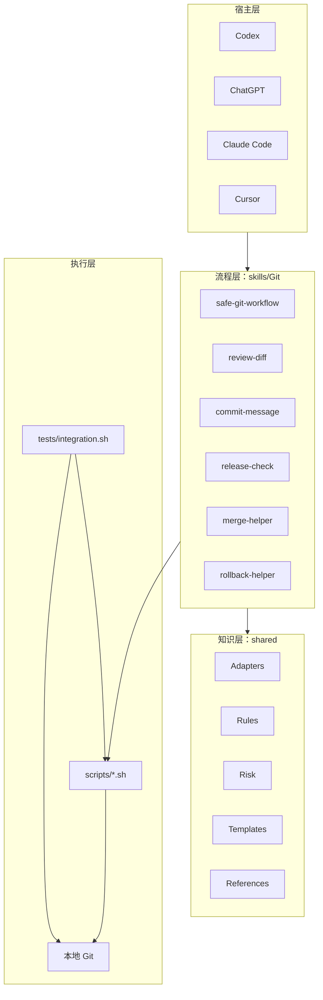
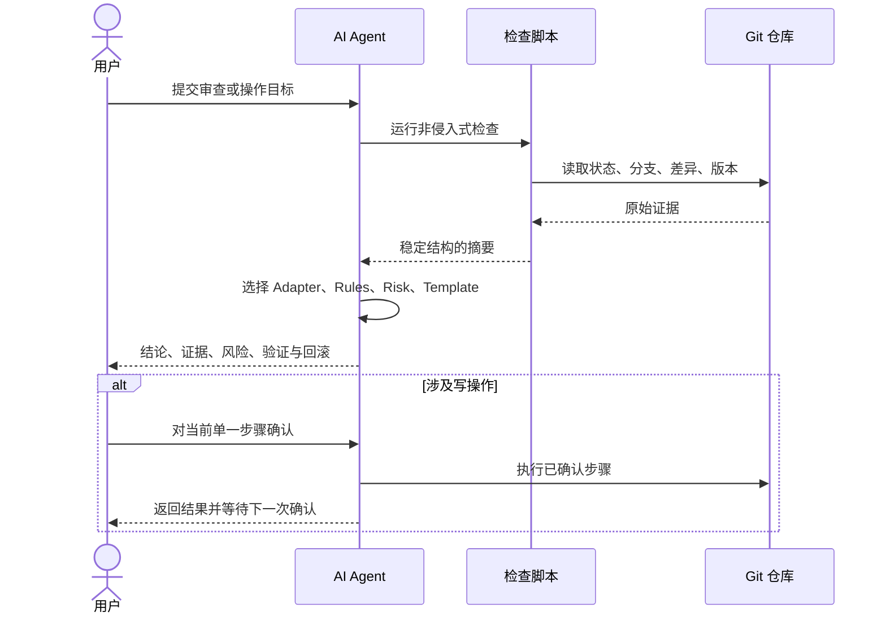

# 架构

## 设计目标

本仓库把易变的宿主调用方式、可复用的 Git 决策流程、确定性检查器和技术栈知识分离。新增宿主或技术栈时，优先增加 Adapter 或安装说明，不复制整套 Skill。

## 分层模型

## 组件职责

### Skill

`SKILL.md` 定义触发条件、输入、步骤、确认点、输出契约和失败处理。它不复制完整 Git 教程，也不包含平台专属秘密配置。每个 Skill 只解决一个决策域。

### agents/openai.yaml

保存 OpenAI 宿主的 UI 名称、短说明和默认提示词。它不改变 Skill 的安全边界，也不声明本项目不需要的 MCP 依赖。

### Shell 检查器

脚本负责可重复的证据采集和静态门禁。公共函数在 `shared/scripts/lib.sh`，包括仓库检测、命令检测、输出格式和路径定位。脚本不改变工作区内容、refs 或暂存内容；Git 的 `status`、`diff` 等命令可能刷新 index 的 stat 元数据，因此不承诺字节级只读。`branch_sync.sh` 不会隐式执行 `fetch`，避免离线检查触发网络或凭据访问。

### Adapter

Adapter 根据文件和构建配置识别项目类型，并定义“检查什么、忽略什么、高风险是什么”。Adapter 不替代项目自身的构建脚本和测试说明。

### Rules 与 Risk

Rules 定义领域检查表；Risk 定义严重性与处置。结论必须先引用规则证据，再映射风险，不允许仅凭文件扩展名给出 Critical 结论。

### Templates

Templates 固定报告字段，保证不同 Agent 和宿主的输出可比较。模板是输出契约，不是要求机械填满所有字段；无证据的字段应明确写“未验证”及原因。

## 数据流

## 安全不变量

1. 分析不会隐式升级为执行。
2. 工作区确认不能替代暂存区确认。
3. commit 确认不能替代 push 确认。
4. fetch 只更新远端跟踪引用，不等于允许 merge 或 rebase。
5. 公共历史优先使用 `revert`，未共享的本地历史才评估 `reset`。
6. `git reset --hard`、强制推送和递归强删始终禁止。

## 扩展点

- 新技术栈：新增 `shared/adapters/<stack>.md`，并在审查规则和示例中接入。
- 新 Git 能力：新增聚焦 Skill，复用已有脚本和模板，避免扩张单个 Skill。
- 新宿主：补充安装/调用说明；核心 Skill 继续遵循开放 `SKILL.md` 结构。
- MCP：未来只负责获取远端 PR、CI 或托管平台证据，不改变本地危险操作确认模型。
